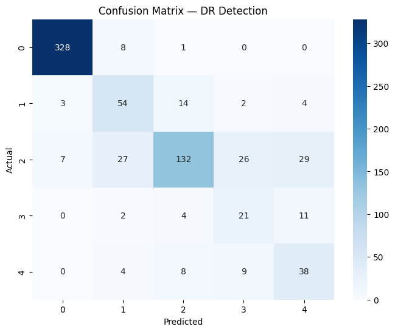
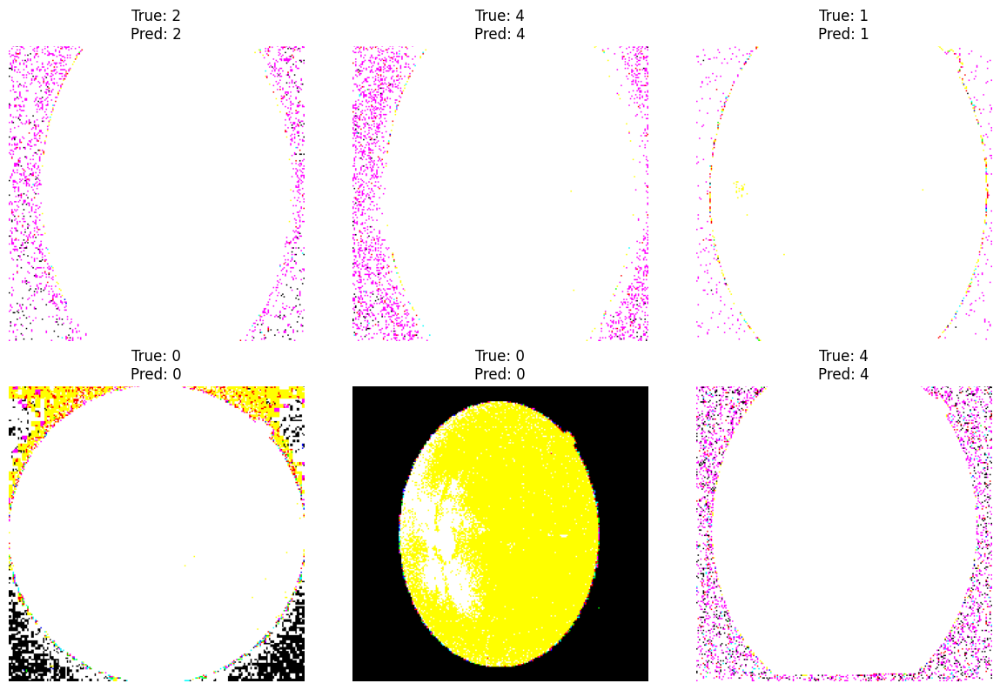

# Eye Disease Detection Model (Diabetic Retinopathy Detection)

## Overview
A deep learning model to detect and classify Diabetic Retinopathy severity from retinal fundus images, aimed at supporting early diagnosis of eye disease. Built and trained using a CNN-based image classification approach on retinal scan data.

## Dataset
- **Source:** APTOS 2019 Blindness Detection
- **Access:** [APTOS 2019 Blindness Detection — Kaggle](https://www.kaggle.com/c/aptos2019-blindness-detection)
- **Classes:** 5 severity levels of Diabetic Retinopathy (0 = No DR, through 4 = Proliferative DR)

## Results
- **Validation Accuracy: 78.28%**
- Strong performance on majority class (No DR): **0.97 precision / 0.97 recall**
- Weighted average F1-score: **0.79** across all 5 severity classes

### Confusion Matrix

### Sample Predictions

## Method
- **Tools:** Python, TensorFlow/Keras, NumPy, Matplotlib, scikit-learn
- **Approach:** Image preprocessing → CNN model training with class weighting (to handle class imbalance) → checkpointing on best validation accuracy → early stopping → evaluation via classification report and confusion matrix
- **Training:** 10 epochs with `ModelCheckpoint` (saving best model by validation accuracy) and `EarlyStopping` to prevent overfitting

## Files
- `dr-detection-eye-disease-model.ipynb` — full notebook with code, training logs, and evaluation outputs
- `confusion_matrix.png` — confusion matrix on validation set
- `sample_predictions.png` — sample true vs. predicted labels on validation images

## Notes
This is a classification model trained on a public research dataset for educational/portfolio purposes, not a certified diagnostic tool.
